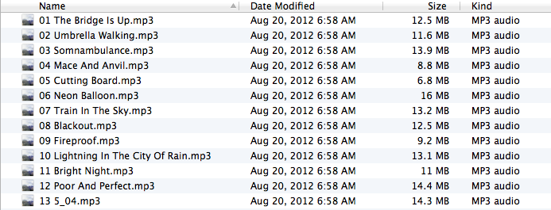
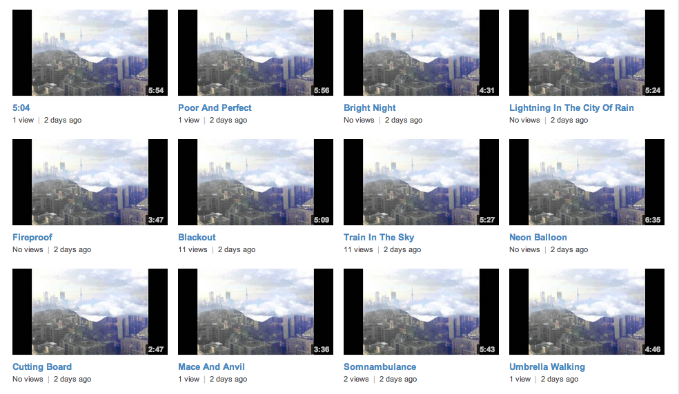

## mp3toyoutube
### Turns MP3s like this:

### Into YouTube Videos like this:

All you need is a couple Google API keys and a couple Python libraries. See below for dependencies.

##Usage

    usage: mp3toyoutube.py [-h] [--image IMAGE] [--category CATEGORY]
                           [--description DESCRIPTION] [--keyword KEYWORDS]
                           [--make-public] [--api-key-path API_KEY_PATH]
                           [--google-access-token TOKEN]
                           audio_files [audio_files ...]
    
    Create and upload YouTube videos from MP3s.
    
    positional arguments:
      audio_files           paths to the audio files to create video files from.
    
    optional arguments:
      -h, --help            show this help message and exit
      --image IMAGE         path to the image to use as cover art
      --category CATEGORY   YouTube "category" parameter to put the videos into
      --description DESCRIPTION
                            YouTube description for all videos (- to read from
                            stdin)
      --keyword KEYWORDS    keywords, each in their own separate --keyword arg
      --make-public         automatically mark uploaded videos as public. Default:
                            private
      --api-key-path API_KEY_PATH
                            path to a YML file containing YouTube API keys
      --google-access-token TOKEN
                            pre-fetched Google oauth access token
                            
##Installation

First, get the code and its dependencies. (`ffmpeg` isn't bundled - you'll need to make sure that's installed yourself.)

    git clone git@github.com:psobot/mp3toyoutube.git && cd mp3toyoutube
    sudo pip install -r requirements.txt
    
Then, spend a couple boring minutes to generate your API keys at the Google:

 - `developer_key` can be generated at: https://code.google.com/apis/youtube/dashboard/gwt/index.html
 - `client_id`, `client_secret` and `redirect_uris` can be created at https://developers.google.com/youtube/2.0/developers_guide_protocol_oauth2#OAuth2_Register
   - **Note**: `mp3toyoutube` is an local app, so you'll need to choose "**Installed Application**" when creating a Client ID in the Google OAuth control panel.

Finally, add those keys to a file called apikeys.yml:
    
    mv apikeys.yml.sample apikeys.yml
    vim apikeys.yml
    
And you're done!